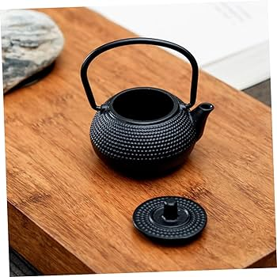
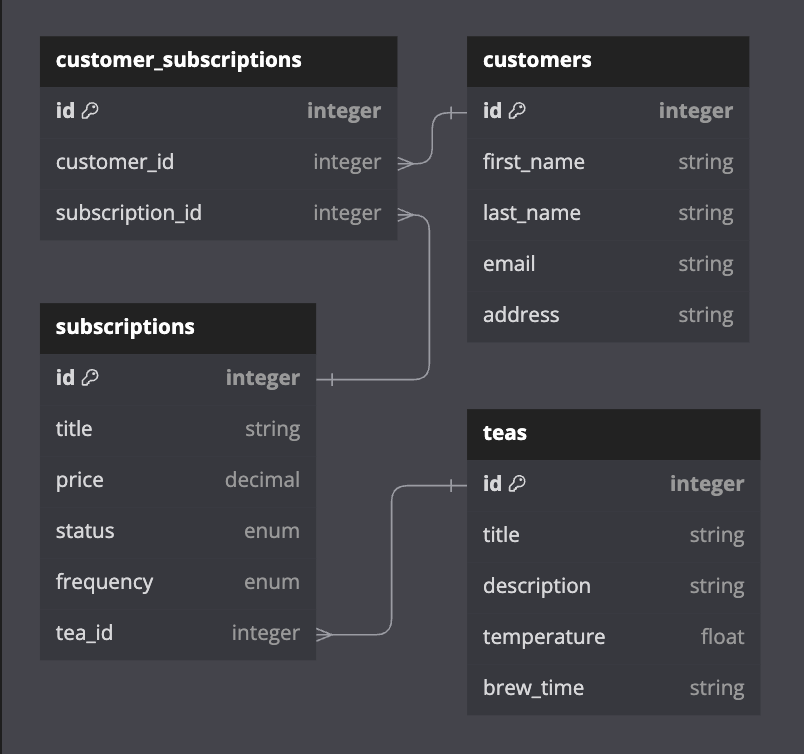
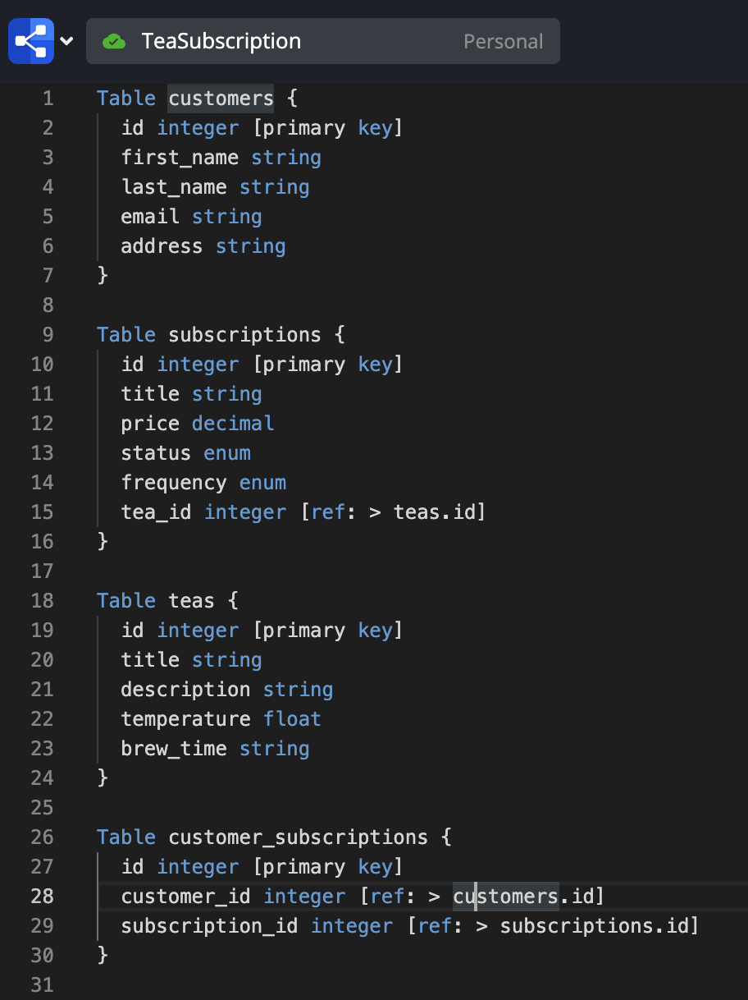

<a name="readme-top"></a>
<!-- PROJECT SHIELDS -->
[![Contributors][contributors-shield]][contributors-url]
[![Forks][forks-shield]][forks-url]


<!-- PROJECT LOGO -->
<br />
<div align="center">
  <a href="https://github.com/Sykogst/tea_subscription_api">
    
  </a>
</div>


<!-- TABLE OF CONTENTS -->
<details>
  <summary>Table of Contents</summary>
  <ol>
    <li>
      <a href="#about-the-project">About The Project</a>
      <ul>
        <li><a href="#built-with">Built With</a></li>
        <li><a href="#gems">Gems</a></li>
      </ul>
    </li>
    <li>
      <a href="#getting-started">Getting Started</a>
      <ul>
        <li><a href="#installation">Installation</a></li>
      </ul>
    </li>
    <li><a href="#schema">Schema</a></li>
    <li><a href="#roadmap">Roadmap</a></li>
    <li><a href="#improvements">Improvements</a></li>
    <li><a href="#endpoints">Endpoints</a></li>
    <li><a href="#contributors">Contributors</a></li>
  </ol>
</details>


<!-- ABOUT THE PROJECT -->
## About The Project
This is is a Rails API for a Tea Subscription Service providing various endpoints to be consumed by a frontend application. It displays an understanding of using Rails to set up an API using test driven development (TDD), the ability to create endpoints using restful routes, and demonstration of code organization following object oriented programming (OOP)


### Built With
* [![Ruby on Rails][Rails-shield]][Rails-url]

<p align="right">(<a href="#readme-top">back to top</a>)</p>

### Gems

### Production
* [![jsonapi-serializer][gem-jsonapi-serializer]][gem-jsonapi-serializer-url]

### Testing
* [![rspec-rails][gem-rspec-rails]][gem-rspec-rails-url]
* [![simplecov][gem-simplecov]][gem-simplecov-url]
* [![factory_bot_rails][gem-factory_bot_rails]][gem-factory_bot_rails-url]
* [![faker][gem-faker]][gem-faker-url]
* [![pry][gem-pry]][gem-pry-url]
* [![shoulda-matchers][gem-shoulda-matchers]][gem-shoulda-matchers-url]

<p align="right">(<a href="#readme-top">back to top</a>)</p>

<!-- GETTING STARTED -->
## Getting Started

To get a local copy up and running follow these simple example steps.

### Installation

1. Clone the repo
   ```sh
   git clone https://github.com/Sykogst/tea_subscription_api.git
   ```
    ```
2. Gem Bundle
   ```sh
    bundle
   ```
3. Rake
   ```sh
    rails db:{drop,create,migrate,seed}
   ```

<p align="right">(<a href="#readme-top">back to top</a>)</p>


<!-- Schema -->
## Schema




### Design Decisions
- Subscriptions-Teas, one-to-one relationship over-one-to many
	1. Simplicity and intuitive
	2. Data retrieval is also more straight forward
- Assumption that subscriptions are preset/premade
	1. JSON response body sent to create a customer subscription only includes customer ID and subscription ID
	2. If not, response body would have to include parameters required to create a subscription in the same single request
- Made a decision to add a enum status column into the  `customer_subscriptions` table
	1. Default is set to 0, corresponding to active
	2. Toggle of this enum to cancelled using and endpoint
- Routes for cancelling subscription, `collection`
	1. Used for the `PATCH` request that toggles a users subscription status to cancelled for a specific customer_subscription ID
	2. It is on a joins record so acts on all, just the single record
	3. id is sent through json payload
- To keep RESTful routes, sending customer ID as a query param for the `GET` request 
	1. Also added customer_id to json response for usability

<p align="right">(<a href="#readme-top">back to top</a>)</p>


<!-- ROADMAP -->
## Roadmap

- [x] Endpoint to subscribe a customer to a tea subscription
    - [x] `POST /subscriptions`
    - [x] Customer ID and Subscription ID, sent through json payload body NOT query params
    - [x] Create a new subscription for a specified customer, including a selected tea
    - [x] `400`, `404`, `422` error handling
- [x] Endpoint to cancel a customer's tea subscription
    - [x] `PATCH /customer_subscriptions/cancel`
    - [x] Customer Subscription ID, sent through json payload body NOT query params
    - [x] Remove a specified subscription
    - [x] `404`, `422` error handling
- [ ] Endpoint to see all customer's subscriptions
    - [x] `GET /customers_subscriptions`
    - [x] Customer Subscription ID, sent through query params
    - [x] Retrieve all subscriptions for a specified customer (active and cancelled) 
    - [x] `404` error handling

<p align="right">(<a href="#readme-top">back to top</a>)</p>


<!-- Improvements -->
## Improvements
- [ ] Clean up JSON response formatting in the `GET /customers_subscriptions` endpoint to more closely follow JSON convnetions
- [ ] Add more endpoints, just a few ideas
  - [ ] such as a PATCH to make a subscription active
  - [ ] ALL current active subscriptions
  - [ ] DELETE a subscription or customer subscription entirely
- [ ] Consume external API for tea information, [Spoonacular API](https://spoonacular.com/food-api/docs)

<p align="right">(<a href="#readme-top">back to top</a>)</p>


<!-- Endpoints -->
## Endpoints

### Subscribe a Customer to a Tea Subscription
* **`POST api/v0/customer_subscriptions`**
  - Example Request:
    ```
    POST /api/v0/customer_subscriptions
    Content-Type: application/json
    Accept: application/json

    {
        "customer_id": 1,
        "subscription_id": 1
    }
    ```
  - Example Response:
    ```json
    {
        "data": {
            "id": "1",
            "type": "customer_subscription",
            "attributes": {
                "customer_id": 1,
                "subscription_id": 1,
                "status": "active"
            },
            "relationships": {
                "customer": {
                    "data": {
                        "id": "1",
                        "type": "customer"
                    }
                },
                "subscription": {
                    "data": {
                        "id": "1",
                        "type": "subscription"
                    }
                }
            }
        }
    }
    ```
  - Error Handling
  1. `404` Invalid Customer ID, Customer cannot be found
  2. `404` Invalid Subscription ID, Subscription cannot be found
  3. `400` Blank/Null Customer ID
  4. `400` Blank/Null Subscription ID
  5. `422` Customer Subscription Already Exists

### Cancel a Customer's Tea Subscription
* **`PATCH /api/v0/customer_subscriptions/cancel`**
  - Example Request:
    ```
    PATCH /api/v0/customer_subscriptions/cancel
    Content-Type: application/json
    Accept: application/json

    {
      "customer_subscription_id": 1,
    }
    ```
  - Example Response:
    ```json
    {
        "data": {
            "id": "1",
            "type": "customer_subscription",
            "attributes": {
                "customer_id": 1,
                "subscription_id": 1,
                "status": "cancelled"
            },
            "relationships": {
                "customer": {
                    "data": {
                        "id": "1",
                        "type": "customer"
                    }
                },
                "subscription": {
                    "data": {
                        "id": "1",
                        "type": "subscription"
                    }
                }
            }
        }
    }
    ```
    - Error Handling
    1. `404` Invalid Customer Subscription ID
    2. `422` Status Already Cancelled

### See all of a Customer's Subscriptions (active and cancelled)
* **`GET /api/v0/customer_subscriptions`**
  - Example Request:
    ```
    GET /api/v0/customer_subscriptions?customer_id=1
    ```
  - Example Response:
    ```json
    {
        "customer_id": 1,
        "subscriptions": {
            "data": [
                {
                    "id": "1",
                    "type": "subscription",
                    "attributes": {
                        "id": 1,
                        "title": "Monthly Green Tea Box",
                        "price": "19.99",
                        "status": "active",
                        "frequency": "monthly"
                    },
                    "relationships": {
                        "tea": {
                            "data": {
                                "id": "1",
                                "type": "tea"
                            }
                        }
                    }
                },
                {
                    "id": "2",
                    "type": "subscription",
                    "attributes": {
                        "id": 2,
                        "title": "Weekly Black Tea Special",
                        "price": "24.99",
                        "status": "cancelled",
                        "frequency": "weekly"
                    },
                    "relationships": {
                        "tea": {
                            "data": {
                                "id": "2",
                                "type": "tea"
                            }
                        }
                    }
                }
            ]
        }
    }
    ```
    - Error Handling
    1. `404` Invalid Customer ID, Customer cannot be found


## Contributors

Sam Tran 
 
[![LinkedIn][linkedin-shield]][linkedin-url-st]
[![GitHub][github-shield-st]][github-url-st]


<!-- MARKDOWN LINKS & IMAGES -->
<!-- https://www.markdownguide.org/basic-syntax/#reference-style-links -->
[contributors-shield]: https://img.shields.io/github/contributors/tea_subscription_api.svg?style=for-the-badge
[contributors-url]: https://github.com/tea_subscription_api/graphs/contributors
[forks-shield]: https://img.shields.io/github/forks/tea_subscription_api.svg?style=for-the-badge
[forks-url]: https://github.com/tea_subscription_api/network/members
[stars-shield]: https://img.shields.io/github/stars/tea_subscription_api.svg?style=for-the-badge
[stars-url]: https://github.com/tea_subscription_api/stargazers
[issues-shield]: https://img.shields.io/github/issues/tea_subscription_api.svg?style=for-the-badge
[issues-url]: https://github.com/tea_subscription_api/issues
[license-shield]: https://img.shields.io/github/license/tea_subscription_api.svg?style=for-the-badge
[license-url]: https://github.com/tea_subscription_api/blob/master/LICENSE.txt
[linkedin-shield]: https://img.shields.io/badge/-LinkedIn-black.svg?style=for-the-badge&logo=linkedin&colorB=555
[linkedin-url-st]: https://www.linkedin.com/in/sam-t-tran

[product-screenshot]: images/screenshot.png

[Rails-shield]: https://img.shields.io/badge/Ruby%20on%20Rails-CC0000?style=for-the-badge&logo=ruby-on-rails&logoColor=white
[Rails-url]: https://rubyonrails.org/
[HTML-shield]: https://img.shields.io/badge/HTML5-E34F26?style=for-the-badge&logo=html5&logoColor=white
[HTML-url]: https://developer.mozilla.org/en-US/docs/Web/HTML
[JavaScript-shield]: https://img.shields.io/badge/JavaScript-F7DF1E?style=for-the-badge&logo=javascript&logoColor=black
[JavaScript-url]: https://developer.mozilla.org/en-US/docs/Web/JavaScript
[PostgreSQL-shield]: https://img.shields.io/badge/PostgreSQL-336791?style=for-the-badge&logo=postgresql&logoColor=white
[PostgreSQL-url]: https://www.postgresql.org/

[gem-debug]: https://img.shields.io/badge/debug-1.9.1-brightgreen?style=flat-square
[gem-debug-url]: https://rubygems.org/gems/debug

[gem-rspec-rails]: https://img.shields.io/badge/rspec--rails-6.1.0-green?style=flat-square
[gem-rspec-rails-url]: https://github.com/rspec/rspec-rails

[gem-simplecov]: https://img.shields.io/badge/simplecov-0.22.0-yellow?style=flat-square
[gem-simplecov-url]: https://github.com/simplecov-ruby/simplecov

[gem-factory_bot_rails]: https://img.shields.io/badge/factory_bot_rails-6.4.0-success?style=flat-square
[gem-factory_bot_rails-url]: https://github.com/thoughtbot/factory_bot_rails

[gem-faker]: https://img.shields.io/badge/faker-3.2.2-red?style=flat-square
[gem-faker-url]: https://github.com/faker-ruby/faker

[gem-pry]: https://img.shields.io/badge/pry-0.14.2-yellow?style=flat-square
[gem-pry-url]: https://github.com/pry/pry

[gem-shoulda-matchers]: https://img.shields.io/badge/shoulda--matchers-6.0.0-orange?style=flat-square
[gem-shoulda-matchers-url]: https://github.com/thoughtbot/shoulda-matchers

[gem-faraday]: https://img.shields.io/badge/faraday-2.8.1-yellowgreen?style=flat-square
[gem-faraday-url]: https://github.com/lostisland/faraday

[gem-jsonapi-serializer]: https://img.shields.io/badge/jsonapi--serializer-2.2.0-blue?style=flat-square
[gem-jsonapi-serializer-url]: https://github.com/jsonapi-serializer/jsonapi-serializer

[gem-capybara]: https://img.shields.io/badge/capybara-3.39.2-brightgreen?style=flat-square
[gem-capybara-url]: https://github.com/teamcapybara/capybara

[gem-webmock]: https://img.shields.io/badge/webmock-3.19.1-yellowgreen?style=flat-square
[gem-webmock-url]: https://github.com/bblimke/webmock

[gem-vcr]: https://img.shields.io/badge/vcr-6.2.0-orange?style=flat-square
[gem-vcr-url]: https://github.com/vcr/vcr

[github-shield-st]: https://img.shields.io/badge/GitHub-Sykogst-success?style=for-the-badge&logo=github
[github-url-st]: https://github.com/Sykogst